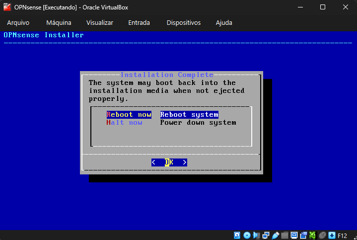
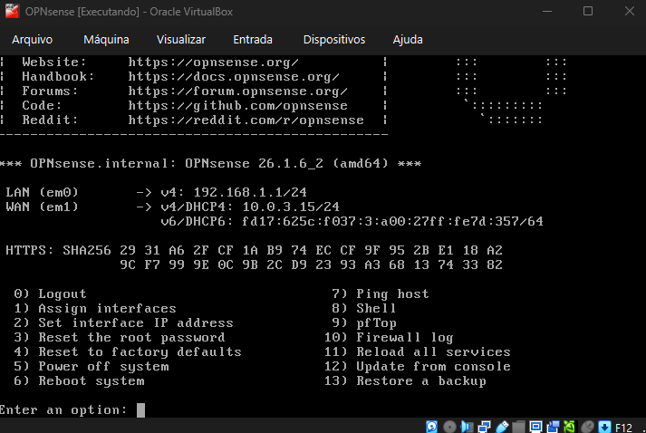
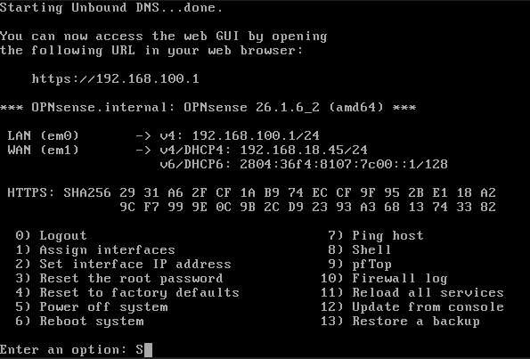
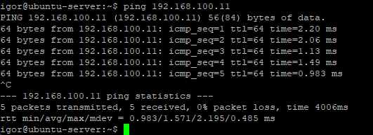
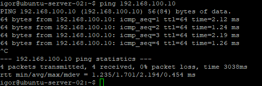

# pfSense

## Objetivo

Implementar um firewall/router virtualizado no Home Lab para segmentação de rede, roteamento entre VMs, controle de tráfego e futuramente aplicação de regras de segurança e serviços de infraestrutura.

Inicialmente foi utilizada a ISO da Netgate (pfSense CE v1.2), porém ocorreram travamentos durante a instalação. Como alternativa, o projeto migrou para o OPNsense, que apresentou maior estabilidade no ambiente virtualizado.

---

## Instalação do OPNsense

### Problemas encontrados durante instalação do pfSense

- A instalação da ISO Netgate v1.2 travou duas vezes
- O sistema congelava durante o processo de setup
- A VM precisou ser reiniciada manualmente em ambas as tentativas

### Solução adotada

- Substituição do pfSense pelo OPNsense
- Instalação concluída com sucesso
- Ambiente estabilizado após troca da ISO

### Instalação concluida:



---

## Interfaces WAN e LAN

### Primeiro boot do sistema




### Configuração atual

| Interface | Função | IP |
|---|---|---|
| WAN | Acesso à rede externa | 192.168.18.45 |
| LAN | Rede interna das VMs | 192.168.100.1 |
| OPT1 | Rede Host-Only para gerenciamento | 192.168.56.1 |

### Interfaces configuradas




### Redes utilizadas no VirtualBox

| Adaptador | Tipo de rede |
|---|---|
| Adaptador 1 | Rede Interna |
| Adaptador 2 | Bridge |
| Adaptador 3 | Host-Only |

---

## Comunicação entre VMs

Após a configuração da interface LAN:

- As VMs Ubuntu foram migradas para o range `192.168.100.x`
- Gateway configurado apontando para `192.168.100.1`
- Comunicação entre máquinas funcionando corretamente através do OPNsense

### Testes realizados

- Ping entre VMs Ubuntu
- Verificação de roteamento interno
- Teste de comunicação passando pelo firewall virtual


### Teste de comunicação entre VMs
As duas máquinas Ubuntu conseguiram se comunicar usando o OPNsense como gateway da rede interna.






---

## Tentativa de acesso à interface web

### Objetivo

Permitir gerenciamento do OPNsense pela máquina host utilizando uma interface Host-Only.

### Configuração realizada

- Adicionado Adaptador 3 em modo Host-Only
- Interface OPT1 configurada com IP `192.168.56.1`

### Problema encontrado

O acesso à interface web não funcionou.

Possíveis causas identificadas:

- Firewall bloqueando tráfego na interface OPT1
- Regras padrão sem liberação para acesso HTTPS
- Instabilidade causada por múltiplas reatribuições de interfaces no console

### Estado atual

- Interfaces WAN, LAN e OPT1 configuradas
- Endereçamento IP funcional
- Interface web ainda inacessível

---

## DHCP

### Status atual

Ainda não configurado.

### Planejamento

O DHCP será utilizado para:

- Distribuição automática de IPs internos
- Definição automática de gateway
- Padronização da rede interna do laboratório

Faixa planejada:

```text
192.168.100.100 - 192.168.100.200
