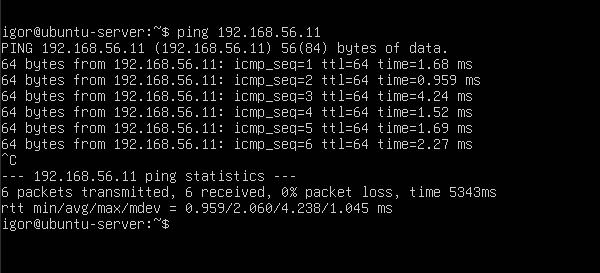
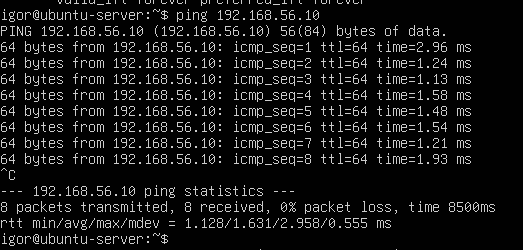
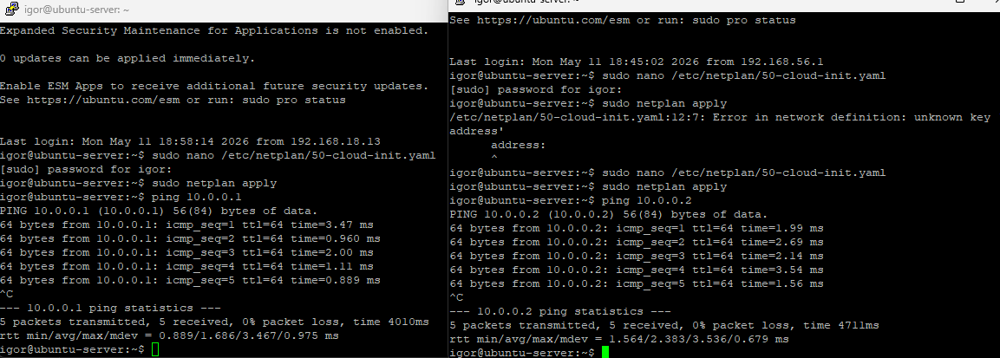

# Rede
## Topologia atual

A VM Ubuntu Server utiliza dois adaptadores simultaneamente:
- **Adaptador 1 (Bridge):** conecta a VM à rede local via roteador. IP dinâmico via DHCP. Permite acesso à internet.
- **Adaptador 2 (Host-Only):** conecta a VM diretamente ao host Windows. IP fixo `192.168.56.10`. Usado para conexão SSH mais estável.

Essa configuração garante que o IP não mude entre reinicializações da VM ou do Host.

## Teste de comunicação entre VMs
VM: ubuntu-server, interface: enp0s8, IP: 192.168.56.10
VM: ubuntu-server2, interface: enp0s8, IP 192.168.56.11

### Teste realizado
Ping bidirecional entre as VMs pela rede Host-Only.
```bash
# Na ubuntu-server-02
ping 192.168.56.10

# Na ubuntu-server
ping 192.168.56.11
```

### Resultado
Ambos os testes retornaram respostas, confirmando a comunicação entre as VMs.





## Teste de comunicação via Internal Network

### Configuração

| VM | Interface | IP |
|---|---|---|
| ubuntu-server | enp0s9 | 10.0.0.1 |
| ubuntu-server-02 | enp0s9 | 10.0.0.2 |

### Modo Internal Network

VMs se comunicam em rede completamente isolada. O host não participa.  
Esse é o modo que será usado futuramente com o pfSense como gateway controlando o tráfego interno.

### Teste realizado

```bash
# Na ubuntu-server-02
ping 10.0.0.1

# Na ubuntu-server
ping 10.0.0.2
```

### Resultado

Ambos retornaram sucesso, confirmando isolamento e comunicação entre VMs.



## Topologia futura (com pfSense)

O pfSense assumirá o controle de roteamento e DHCP interno. As VMs passarão a usar Internal Network, com o pfSense como gateway, assim eliminando a dependência do roteador doméstico para comunicação entre VMs.
