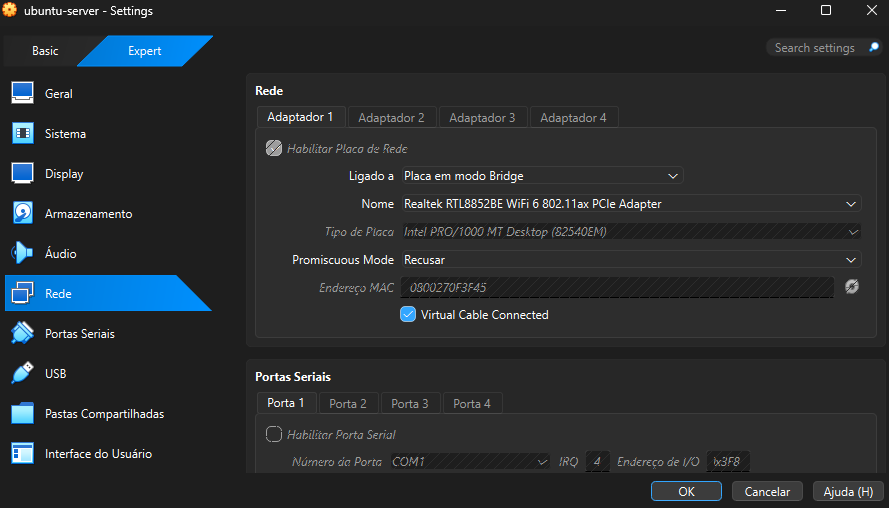

# Troubleshooting

## Problema: SSH não funcionava entre Windowss host e Ubuntu Server
### Cenário
- Host: WIndows 11
- VirtualBox em uso
- VM Ubuntu Server
- OpenSSH instalado durante a instalação do sistema
  
### Sintoma
A conexão SSH falhava ao executar:
ssh igor@10.0.2.15

### Verificações realizadas
- Serviço SSH ativo
- IP da VM correto
- Conectividade com internet funcionando dentro da VM
  
### Causa Identificada
A interface de rede da VM estava em modo NAT.
Com isso a VM possui acesso a internet, porém o host não consegue iniciar conexões diretamente para ela sem configuração adicional de port forwarding.

### Solução
Alteração da configuração de rede da VM de:
NAT

para:

modo Bridge

Após alteração, a VM recebeu um IP da rede local.

### Resultado
Conexão SSH estabelecida com sucesso entre o host Windows e a VM Ubuntu Server.

