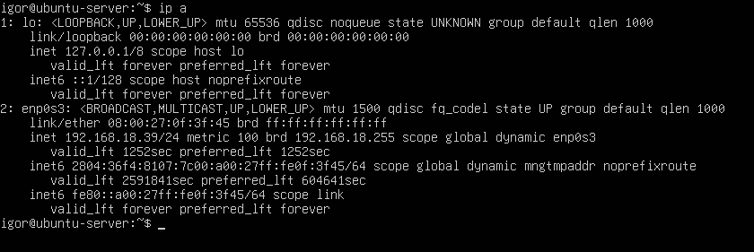
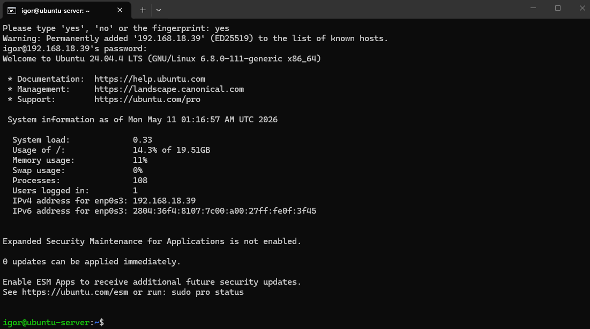
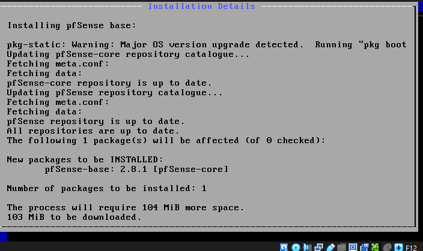

# Troubleshooting

## Problema: SSH não funcionava entre Windowss host e Ubuntu Server
### Cenário
- Host: WIndows 11
- VirtualBox em uso
- VM Ubuntu Server
- OpenSSH instalado durante a instalação do sistema
  
### Sintoma
A conexão SSH falhava ao executar:
ssh igor@10.0.2.15

### Verificações realizadas
- Serviço SSH ativo
- IP da VM correto
- Conectividade com internet funcionando dentro da VM
  
### Causa Identificada
A interface de rede da VM estava em modo NAT.
Com isso a VM possui acesso a internet, porém o host não consegue iniciar conexões diretamente para ela sem configuração adicional de port forwarding.

### Solução
Alteração da configuração de rede da VM de:
NAT

para:

modo Bridge

Após alteração, a VM recebeu um IP da rede local.

### Resultado
Conexão SSH estabelecida com sucesso entre o host Windows e a VM Ubuntu Server.

---

## Problema: Travamento durante instalação do pfSense

### Cenário

- VM criada no Oracle VirtualBox
- Utilização da ISO Netgate/pfSense
- Ambiente do Home Lab em fase de implementação do firewall virtual

### Sintoma

A instalação travou duas vezes durante o setup do sistema.

### Comportamento observado

- Congelamento da interface de instalação
- Instalação não concluída
- Necessidade de reinicialização manual da VM

### Solução adotada

O pfSense foi substituído pelo OPNsense.

A instalação do OPNsense ocorreu normalmente, sem travamentos durante o setup ou primeiro boot.

### Resultado

Ambiente estabilizado utilizando OPNsense como firewall/router principal do laboratório.

---

## Problema: Falha de acesso à interface WebGUI do OPNsense

### Cenário

Após a configuração inicial do OPNsense, foi criada uma interface adicional para gerenciamento via Host-Only.

Configuração utilizada:

| Interface | IP |
|---|---|
| OPT1 | 192.168.56.1 |

### Sintoma

A interface web do OPNsense não consegue ser acessada pelo host Windows.

### Verificações realizadas

- Adaptador Host-Only configurado no VirtualBox
- Interface OPT1 criada corretamente
- Endereçamento IP configurado
- Reatribuições de interfaces realizadas no console

### Possíveis causas identificadas

- Firewall bloqueando tráfego na interface OPT1
- Ausência de regras permitindo acesso HTTPS
- Instabilidade causada por múltiplas reatribuições de interfaces

### Estado atual

Problema ainda em análise.
